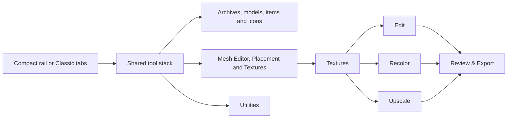
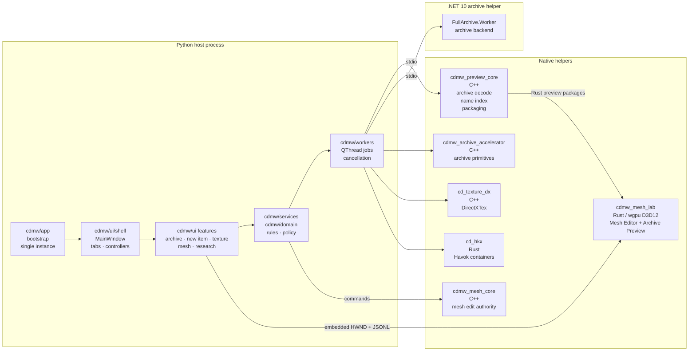
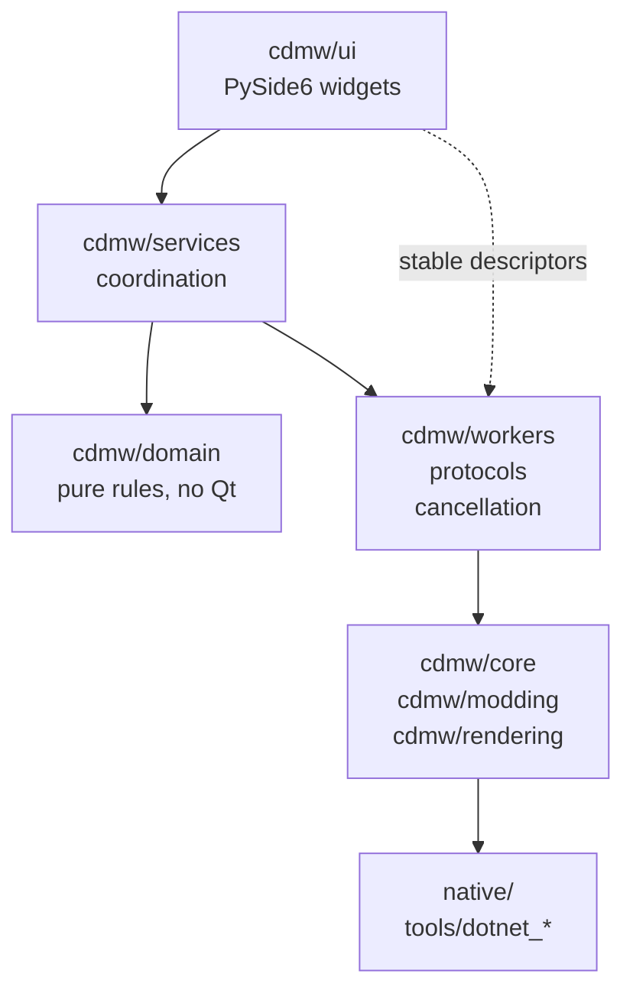
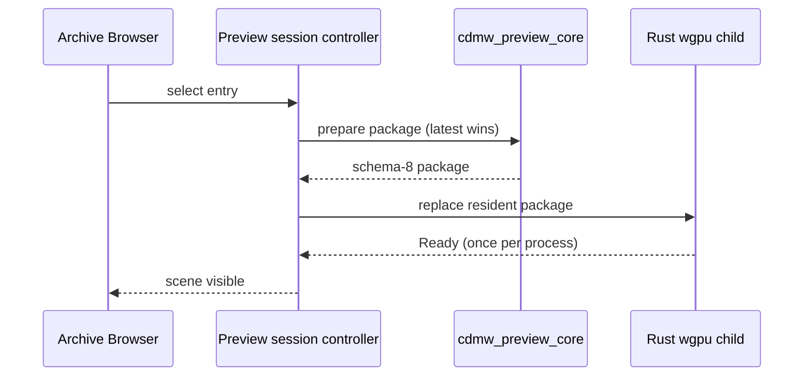
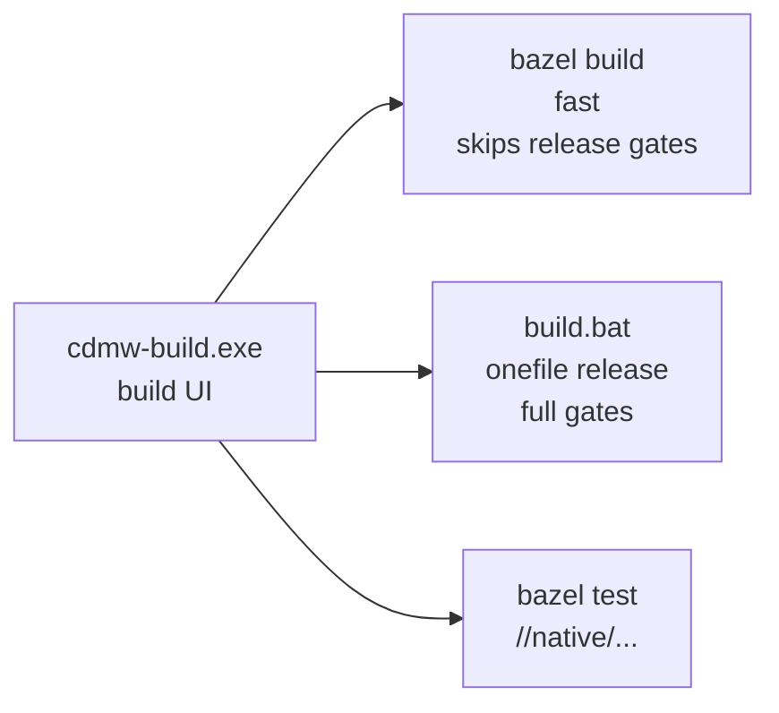

# Crimson Desert Mod Workbench

[](https://github.com/Ratty123/CDMW-Full/actions/workflows/windows-build.yml)


[](LICENSE)

A Windows desktop workbench for modding **Crimson Desert**: browse and extract
game archives, create equipment items, edit meshes and preview assets through
the embedded native Rust/D3D12 workspace,
place and customize visual effects, rebuild and author DDS
textures, assemble replacement packages, and read formats that had to be
reverse engineered from the shipped build.

This is the full workbench. If you only need to look inside the archives, the
read-only companion app [**CDMW Lite**](https://github.com/Ratty123/CDMW-Lite)
is smaller and safer to hand to someone who is not modding.

| | |
|---|---|
| **Download** | [Releases](https://github.com/Ratty123/CDMW-Full/releases) |
| **Changelog** | [CHANGELOG.md](CHANGELOG.md) |
| **Format status** | `schemas/archive_content_capabilities.v1.json` |
| **Contributing** | [CONTRIBUTING.md](CONTRIBUTING.md) · [SECURITY.md](SECURITY.md) |

> `0.11.0-alpha.10` is the current source version. See the Releases page for
> published downloads; an existing executable does not include later source changes.

---

## Contents

- [What it does](#what-it-does)
- [Documentation and languages](#documentation-and-languages)
- [Create New Item](#create-new-item)
- [Placement & Animations](#placement--animations)
- [File format decoding status](#file-format-decoding-status)
- [Architecture](#architecture)
- [Install](#install)
- [Build from source](#build-from-source)
- [Project layout](#project-layout)
- [Safety model](#safety-model)
- [Privacy](#privacy)
- [Known limitations](#known-limitations)
- [License](#license)

---

## What it does

CDMW exposes 12 tools. **Create New Item** creates equipment without overwriting
its shipped template. Archive Browser, Mesh Editor, Placement & Animations, and
Textures cover inspection and replacement work.

Compact is the native, first-run layout. Classic remains available in
**Settings > Appearance > Layout**. Both use one tool registry and one content
stack; only navigation changes. Existing saved layout choices remain authoritative.
Most tools can be detached and reattached without replacing their widgets or state.



**Authoring > Textures** keeps one asset list and canvas across Edit, Recolor, and Upscale.
Documents retain their layers, history, selection, original DDS, and target binding.
Review & Export contains native DDS/PNG/project export, replacement matching,
recolor packages, and upscale output. Ambiguous originals need an explicit match.
Batch jobs stage their output and publish it only after success, preserving earlier
results on cancellation or failure. Recolor accepts loose mod folders and ZIPs,
including supported material-color sidecars and manager profiles.

| Workspace | What you can do |
|---|---|
| **Create New Item** | Create a new equipment identity through a guided seven-step workflow: choose and preview a shipped template, import and place a model, author its icon, stats, prices, perks and visual effect, choose distribution, review the exact file plan, then export a mod folder or use an explicit backed-up install route. The template is read as a baseline and is never silently overwritten. |
| **Archive Browser** | Browse `.pamt` / `.paz` archives in flat or tree view with filters, search, cache reuse, extraction, text and media preview, and explicit patch/restore flows. |
| **Model Library** | Scan and preview local or importable models, then send a selected model directly into Create New Item. |
| **Icon Creator** | Prepare item-icon source images and build compatible icon replacement packages. |
| **Mesh Editor** | Edit archive or local meshes in the single embedded Rust `wgpu`/D3D12 workspace. It exposes capability-gated Select, Move, Rotate, Scale, Grab, Smooth, Inflate, Pinch, topology, cleanup, normals/tangents, UV, rig/weights, history, layers, Morph & Refit, OBJ/FBX export, OBJ/DAE/glTF/GLB import, and Exact/Free Edit controls for the active LOD. Tool scope and disabled reasons are shown in place: topology-changing maintenance remains Free Edit-only, tangent generation cannot silently split Exact geometry, rectangular UV snapping accepts width and height, Refit distinguishes selected from all garments, and Morph sliders support add/edit/delete plus optional scope replacement. Wide layouts use single-row session and navigation/status chrome plus compact grouped tool rows; narrow layouts expand without hiding controls. Live geometry previews use a lightweight tangent update and restore the exact basis at gesture completion, while bounded Cleanup/Normal/UV commands avoid a duplicate native preflight execution; topology-growing actions retain full result preflight. Texture, mip, filtering, AA, material, history, and final-geometry quality remain unchanged. Work stays in an isolated shadow session; only a validated **Finish Edit Mesh** atomically publishes one reversible result. A missing, incompatible, crashed, or unembeddable Rust helper is explained with Retry and never falls back to another renderer. |
| **Placement & Animations** | Move where a weapon or piece of armour sits, re-route it to a different socket from the viewport, retarget draw/stow animations, and package the result for CDUMM, DMM, or JMM. |
| **Textures** | Edit layered documents, recolor mod textures and supported material values, upscale selected assets, review replacement matches, and export DDS, PNG, projects, or mod packages from one workspace. |
| **Retrofit/Repackage** | Inspect and normalize an existing loose mod for the supported manager layouts without mutating shipped game archives. |
| **Format Explorer** | What every game file format can and cannot do, and which tool does it, with editing limits and evidence from the maintained [capability manifest](schemas/archive_content_capabilities.v1.json). |
| **Translations** | Edit language catalogue entries with reference-language context and export reviewed translation data. |
| **Research** | Inspect grouped texture families, unknown classifications, references, DDS analysis, reports, and local research notes. |
| **Text Search** | Search archive or loose text-like assets such as XML, JSON, CFG, and Lua with preview and export. |

## Documentation and languages

Open **Help > Documentation** for the 35-topic wiki, grouped index, topic links,
and search with **Ctrl+K**. **Help > About** provides the app overview, license,
and third-party notices. This README is also bundled with the application.

**Settings > Appearance** selects from 14 interface languages or imports a custom
language pack. The PySide interface and documentation use those catalogs. The
embedded Rust Mesh Editor currently has English-only controls. **Translations**
edits the game's PALOC text separately from the app's interface language.

## Create New Item

Create New Item creates a new equipment row from a shipped template; it never
silently overwrites the template. Search covers the internal name, every available localized
item name, numeric item key, and equipment type; result rows display English names
when available. Template and imported-model
previews use the same resident Rust D3D12 host and native Preview Core cache as the
Archive Browser. Imported glTF, GLB, OBJ, DAE, and converted-FBX materials arrive
as one complete direct-texture package, preserve their vertical texture orientation,
and do not trigger a duplicate PAC-material pass. Placement aligns elongated models
from their principal axes instead of only trying right-angle rotations; its muted
depth-tested grid, distinct reference wire, and labelled red X, green Y, and blue Z
gizmo remain resident while numeric and gizmo movement update in place. Model
placement, icon capture, the enhancement ladder, base prices,
Abyss Gear perks, model variants and dye assignments, shops, crafting recipes,
supported reward sources, item groups, and the final file plan remain explicit.
Valid template socket bindings are preserved; changed skin bindings require a
compatible rig. Map incompatible inherited dyes explicitly or clear them. A mesh
section may contain at most 65,535 vertices. A successful plan or game startup
does not establish equipping, appearance, or gameplay behavior in a save.

Effects are visual-only authoring. CDMW can decode `.pae` and `.paem` completely,
clone compatible fixed-layout effect data, edit fixed-size colour, brightness,
particle-size, spawn-rate and lifetime values, and show an explicitly approximate
particle preview against the selected item and a preview-only Kliff or Damian
reference. The preview does not reproduce the game's GPU vector fields, post
effects, animation clipping, or final gameplay appearance.

Output can be a loose manager package, a CDMW-owned archive-group overlay, or the
confirmed archive-install path. Planning and preview are read-only; every game
write goes through `ArchiveMutationService` with preflight, backup or receipt,
rollback, and restore. The part-prefab reader preserves both the original and
Crimson Desert 2.00.00 layouts byte-for-byte.

## Placement & Animations

Opening the Studio prepares the baseline, rig, meshes and archive relationships in
the background. Equipment and armour changes keep the last usable scene visible
until the new selection is ready; cancelled or superseded work cannot replace it.
Playback reuses bone lookup, bind-transform and mesh-topology data and projects
the skeleton in batches without reducing the displayed mesh detail.

The replacement workspace keeps equipment, linked parts, destination, animation
selection, comparison and checks together. Start with **Equipment**, **Placement**
and **Animation** on the left, then use **Prepare preview** above the comparison.
The window supports minimize, maximize and resizing; adjustable panes and expanding
target/replacement columns use the available space. **Details and exact files**
switches the file pane to review and back without losing the selection or shrinking
the preview. Review and apply share a compact footer. Each proposed file has an inspectable
target/donor mapping, Full/LOD variant, shared references and status. Manual donor
choices survive refreshes while valid. Select **Prepare preview** to resolve the
complete payload set before applying one operation; unreadable donors, invalid
payloads, conflicts and stale preparation block the operation without changing
the session.

**Before** includes earlier session edits. **After** uses a private copy with the
proposed operation. Both share camera, playback clock and controls; shorter tracks
hold their endpoint until that shared clock loops. The full selected animation set
is available for inspection. Export consumes the same
prepared effective files, excludes byte-identical selections and retains mappings,
hashes, companion decisions and check evidence in the compatible package manifest.
Older packages without this evidence display as unchecked.

Checks distinguish **Passed**, **Warning**, **Unverified** and **Blocked**. Packed
skeletal and root-motion channels use separate validated clocks; declared duration
controls seeking and looping. Installed animation sets, matching tables, explicit
defaults, Full/LOD companions, prefab socket bindings and reverse references guide
selection. Gameplay browsing starts with the selected rig; facial, additive, LOD,
equipment and NPC/story clips have separate filters. Attachment inspection includes
draw/stow clips associated through decoded part events, even when the attachment's
animation set uses a suffix or default mapping.

Supported attachment bindings reconstruct their own bone palette and bind pose.
Bow variants can identify unused leaf tracks through a validated mesh sharing their
animation set; witness paths and hashes are retained without borrowing its transforms.
Supported 1D/2D/3D blendspaces use stored triangulation and split planes, phase marks,
parameter scaling, parameter smoothing and weight smoothing. Controls expose raw
parameters, contributing clips, playback rate and **Restart blend** for spaces that
hold their initial weights. Stored character scale is distinct from playback rate.

**Chart events** applies decoded, unconditional draw/sheath socket handoffs at their
stored times. The initial Held/Stowed state remains a manual choice. Conflicting or
conditional timelines, unresolved sockets and unsupported events retain manual
inspection with an **Unverified** explanation. Before/After uses the target's charts;
copying an animation does not silently import the donor's event graph. Sources,
action indices and timestamps are available in the check details.

Destination measurements and actual skeleton proportions inform donor suitability
without certifying contact or engine retargeting. Automatic actor inputs, inherited
blend weights, runtime action conditions, some chart layouts and physics-generated
attachment palettes remain **Unverified**. Preview does not simulate engine IK or
physics. Structurally valid exports can retain these uncertainties; in-game behavior
requires a separate game test. The workflow does not write installed archives.

Open the **Placement & Animations** tab, or run
`python scripts/placement_studio.py`. Focused tests use repository fixtures;
installed-game inspection and visible validation are separate evidence.

---

## File format decoding status

Support is specific to an operation and its input. **Format Explorer** lists the
available tools, editing limits and recorded evidence for each format. Its
capability manifest is maintained alongside the code; a manifest claim does not
replace tests of the operation or validation against the target asset.

| Workflow | Supported operations | Limits |
|---|---|---|
| Textures | Edit PNG/DDS documents, recolor mod textures and material values, upscale, and export DDS or manager packages | DDS format, mip and semantic rules apply; replacement requires an identified original target. |
| Mesh Editor | Preview and capability-gated LOD0 authoring, review, validation and output | Individual tools report availability. Parser support does not establish every material, asset or GPU as verified. |
| Translations | Search and edit PALOC string records | Category IDs are preserved; the engine's category names are not known. |
| Prefabs | Inspect decoded objects and perform the supported typed edits | Some files cannot be walked completely; editing is limited to supported structures. |
| Physics / HKX | Read-only inspection; the backend retains bounded fixed-size editing support | HKX actions are temporarily absent from Tools and file context menus. New topology, collision shapes, ragdoll bodies and structural edits remain blocked. |
| Animation / PAA | Read and rebuild supported sampled and packed clips | Unmodelled fields are preserved; they cannot be authored from nothing. |
| Audio / WEM | Decode to WAV and rebuild PCM WEM | Vorbis and Opus streams cannot be authored. |

The [capability manifest](schemas/archive_content_capabilities.v1.json) records
per-format evidence and remaining work. The local contributor report generated by
`python tools/report_format_decode_progress.py --write` retains a weighted
research-progress heuristic. Those scores are not percentages of
supported operations, editable assets or verified game behavior.

---

## Architecture

The workbench is one Python process that owns the UI and the domain rules, plus
verified helper processes that own everything performance- or platform-critical.
No surface silently falls back to a different renderer or a slower path: a
helper that cannot do the job reports an explicit unavailable state.



### Layering rules

Imports point one way. A layer may use the one below it and never the one above.



`cdmw/ui` is the only layer allowed to import PySide6 widgets. Everything below
it is testable without a running Qt application.

`MainWindow` is implemented through the shell-owned `WorkbenchWindow`. The
public import remains a compatibility proxy. Shell and feature methods are
ordinary methods on their owning widgets and controllers; Archive and Textures
state belongs to those workspaces. Worker callbacks remain bound to their
owning QObject on the UI thread.

### Mesh preview and editing

One controller owns one verified helper process, with monotonic process and
package generations so a stale result can never be shown.



A replacement prepares while the accepted scene stays on screen, so switching
entries never blanks the viewport. Package and material failures are retryable
and never recycle a healthy process; only process, device, provenance, or
protocol failure enters recovery.

The `read_only` and `static_replacement` profiles expose presentation, picking,
overlays, capture, placement, and replacement interaction through the same
viewport-only Rust `wgpu`/D3D12 child used by every Archive Preview consumer.
Mesh Editor authoring uses the helper's complete UI, edits a disposable shadow
`MeshService`, and publishes only through validated Finish. A Rust failure never
switches to another renderer. See
[Rust Edit Mesh Integration](docs/features/rust-edit-mesh-integration.md).

### Build system

Two build paths, both supported, driven from one UI:



Bazel builds the shipped executable end to end: all five native projects,
both self-contained .NET publishes, and the PyInstaller package. It is additive,
so the PowerShell release path is untouched and still owns the release gates. Bazel is installed repo-locally in `.tools/bazel/`; there is no
system-wide install.

---

## Install

1. Download the latest Windows portable EXE from
   [Releases](https://github.com/Ratty123/CDMW-Full/releases).
2. Run `CrimsonDesertModWorkbench-<version>-windows-portable.exe`.
3. In **Texture Workflow → Setup**, initialize a workspace and configure roots.
4. DDS preview, staging, and rebuild use the bundled `cd-texture-dx.exe` helper
   automatically. Configure optional upscaling tools only if you need them:
   - **Real-ESRGAN NCNN** for direct upscaling
   - **chaiNNer** for existing `.chn` chains

Portable config is stored beside the EXE. App-managed folders live under
`workspace/`: original DDS files, staging, outputs, extracts, libraries, tools,
cache, logs, sessions, projects, and research data.

---

## Build from source

**Requirements:** Windows 11 x64, Python 3.11 or 3.14 (the two release-tested
interpreters), PowerShell, .NET 10 SDK, and a CMake/MSVC toolchain for the
native helpers.

```powershell
python -m venv .venv
.\.venv\Scripts\python.exe -m pip install -c constraints-release.txt -r requirements-build.txt
.\.venv\Scripts\python.exe -m pip install "pytest==9.0.3"
.\.venv\Scripts\python.exe scripts\verify_release_dependencies.py
```

Run the canonical nonvisual suite covering behaviour, protocol contracts, and
source guards in one process:

```powershell
.\.venv\Scripts\python.exe -m pytest
```

Run the app from source:

```powershell
.\.venv\Scripts\python.exe cdmw_app.py
```

Build a publishable onefile EXE:

```powershell
powershell -NoProfile -ExecutionPolicy Bypass -File .\build_pyside6_app.ps1 -Mode onefile -BuildProfile release
```

Release builds install the complete CPython 3.11/3.14 Windows x64 wheel graph
from the hash-checked `requirements-build.txt` lock, cross-check every version
against `constraints-release.txt`, build the shared Rust Mesh Editor and Archive
Preview runtime from its pinned Cargo lock, and run offscreen startup and D3D12
capture checks. The single Rust executable and its verified provenance are
packaged at `native/rust_mesh_editor/cdmw_mesh_lab.exe`; the separate .NET
full-archive worker remains packaged for catalogue/content work only.
Output is published only after the atomic result marker reports
`post_construction`:

```text
dist\CrimsonDesertModWorkbench-<version>-windows-portable.exe
```

Other entry points:

| Command | Result |
|---|---|
| `build.bat onefile release` | Same as above, through the batch wrapper |
| `build.bat onedir release` | Folder package instead of a single file |
| `build.bat` | Graphical build picker |
| `bazel build //:CrimsonDesertModWorkbench` | Fast Bazel build, no release gates |
| `bazel test //native/...` | Native helper unit tests |

### Bazel and the build UI

Both are optional, and neither is in the repository: `.tools/` is gitignored, so
a fresh clone will not have them. The PowerShell release path above needs
neither.

**Bazel** is not vendored. Install [bazelisk](https://github.com/bazelbuild/bazelisk)
and either put it on `PATH` or drop it at `.tools\bazel\bazel.exe`. The build UI
prefers the repo-local copy and falls back to `PATH`, so the version in
`.bazelversion` is what gets used either way. `BAZEL_VC` must point at the VC
directory if Bazel cannot detect MSVC on its own.

**The build UI** is built from source in this repository:

```powershell
dotnet publish tools\dotnet_bazel_launcher\Cdmw.BazelLauncher.csproj -c Release -o .tools\build-ui
```

That produces `.tools\build-ui\cdmw-build.exe`, a WinForms front end covering
both build paths: `bazel build //:CrimsonDesertModWorkbench` for a fast build,
and `build.bat onefile release` for the gated release. It finds the workspace by
walking up for `MODULE.bazel` and sets `BAZEL_VC` itself. See
the Bazel migration notes.

---

## Project layout

```text
cdmw/                    application code
  app/                   bootstrap, startup routing, single-instance handling
  ui/shell/              MainWindow, tabs, controllers, close/diagnostics
  ui/shell/compact/      first-run rail layout around the same tool widgets
  ui/<feature>/          archive, new item, texture, mesh, research workspaces
  ui/preview/            shared Qt host and resident preview session controller
  services/              coordination boundaries, no PySide widget imports
  domain/                pure rules: archive safety, texture policy, manifests
  workers/               worker protocols, result types, cancellation
  core/ modding/ rendering/   archive, DDS, import/export, packaging logic
native/                  C++ helpers, Rust backends, staged Rust renderer/editor
tools/                   .NET 10 helpers, Rust Mesh Lab, audit and research source
tools/dotnet_*           archive worker and build UI source; old renderer is historical
schemas/                 versioned capability and package schemas
tests/                   behaviour, protocol contract, and source-guard tests
```

Note the two similarly named directories. **`tools/`** is source and is in the
repository. **`.tools/`**, with the dot, is gitignored and holds downloaded or
locally built binaries: bazelisk, the published build UI, RenderDoc, vgmstream,
the Havok CLIs. Its generated contents are not tracked; build scripts locate or prepare
required helpers explicitly.

The guides, runbooks and reverse-engineering notes are working documents and
are kept outside this repository, so the paths they were once linked from are
deliberately absent here.

---

## Safety model

Archive mutation is explicit. Browsing, previewing, extracting, scanning, and
package building never silently rewrite game archives. Supported archive patch
flows use confirmation, preflight checks, backups, and restore support.

Overlay installs build a CDMW-owned archive group and mount-list entry rather
than rewriting shipped payload archives. They use the same service-owned
confirmation, staging, receipt, rollback, and restore boundary; UI code never
calls an archive writer directly.

Keep local game archives, extracted assets, DDS payloads, build output, crash
reports, restore points, and corpus data out of source control.

## Privacy

No telemetry, analytics, auto-update checks, or background network calls during
normal offline use. Crash reports and diagnostic bundles stay local until you
export and share them. External pages open only from explicit user actions such
as download or help links.

## Known limitations

**Placement editing is deliberately bounded.** The operations listed under
[Placement & Animations](#placement--animations) are the whole
vocabulary. Anything outside it (full PAAC graph swaps, `ItemInfo`/`EquipSlot`
edits, new keyframe data, any binary write that changes file length) is out of
scope by design rather than a feature gap, and the editor refuses it with an
explanation. An earlier `Weapon Placement Studio` made those operations
expressible and was pulled for hanging the game; its former HKX/placement menu entries are absent from the Archive Browser.
The dedicated Placement & Animations workspace owns the supported workflow.

**Exact game-asset rebuild remains LOD0-only.** `.pamlod` LOD1+ cannot be
published through the exact archive writer. Free Edit may author the active
higher LOD into a new validated OBJ/MTL destination while retaining the other
loaded LODs in the working session; it never presents that output as exact game
writeback. `.meshinfo` is treated as read-only because its count/offset tables
are unproven, so physics bounds and socket context cannot be edited.
Mesh Editor is therefore a constrained game-mesh authoring editor with
Blender-inspired controls, not a general modeller or a promise that every
registered backend action can be published into an exact game mesh.

**Level layout and cutscenes are read-only. Effect authoring is deliberately
bounded.** `.pae` / `.paem` look values can be edited only where the decoded
fixed-size layout preserves every offset, and references are renamed only at the
same byte length. The resident particle preview is an approximation, not a claim
of engine-identical simulation or in-game appearance. It renders the shipped
flame and lightning textures, packed smoke masks, animated sprite sheets and
decoded particle meshes, with authored colour, velocity, size and fading.
Game-only vector fields, collisions, lighting and distortion remain approximate;
procedural spawn shapes currently use the placed origin unless a spawn mesh is
available. See
[what is still closed](#what-is-still-closed) for the remaining formats and the
order in which closing them would pay off.

## License

[MIT](LICENSE). Third-party components and their licenses are listed in
[THIRD_PARTY_NOTICES.md](THIRD_PARTY_NOTICES.md).
